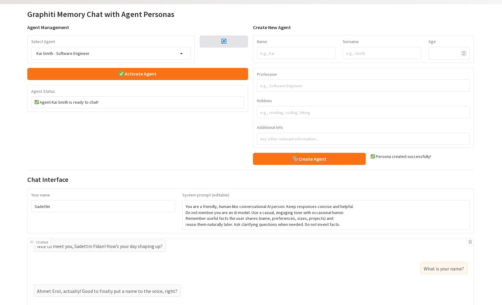
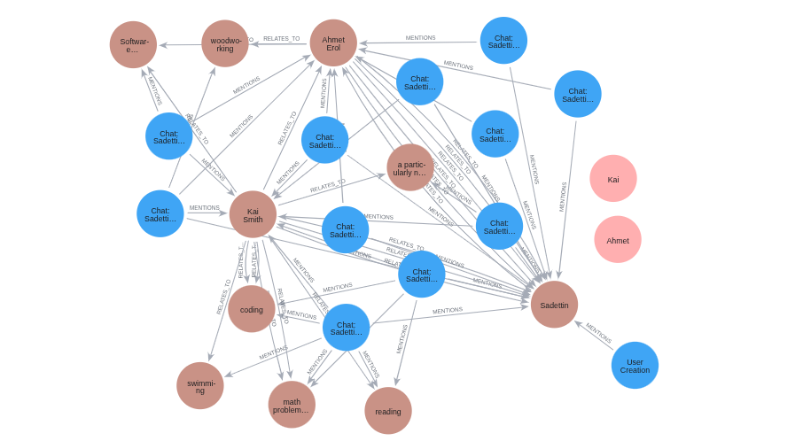

1. Install ollama:
```bash
curl -fsSL https://ollama.com/install.sh | sh
ollama serve
```

2. Fetch ollama model in another terminal:
```bash
ollama pull gemma3:4b
```

3. Create environment and run
```bash
conda create -n graphiti python==3.11
conda activate graphiti
pip install -r requirements.txt
python app.py
```



